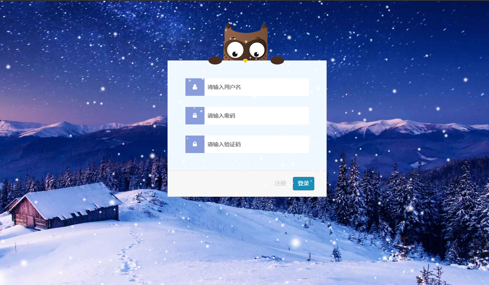

# Google-Authenticator
#### A system is based on Google-Authenticator

#### 界面效果如下图：

#### 登录界面

#### 注册界面

#### 使用php简单实现连接后端进行验证码验证登录，该验证码是基于时间的

# vue-GA

### vue2.0 + koa2 + vuex + vue-router + mysql + element + axios

------

#### 前后端分离，后端使用koa2+sequelize连接数据库，对数据库进行操作，前端使用vue+vuex+vue-router+axios实现页面跳转以及数据传输，界面效果使用element-ui实现的。

##### login_server

###### 登录+注册

##### login_client

##### 目前实现登录注册功能，使用token拦截验证登录状态

##### 实现双因子验证，注册的时候需要扫描二维码添加令牌，登录的时候需要动态口令验证登录

##### 实现效果

